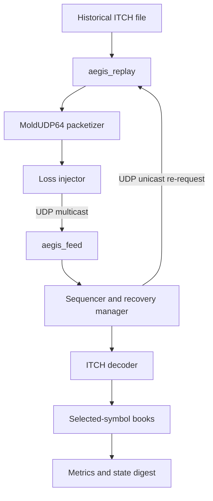
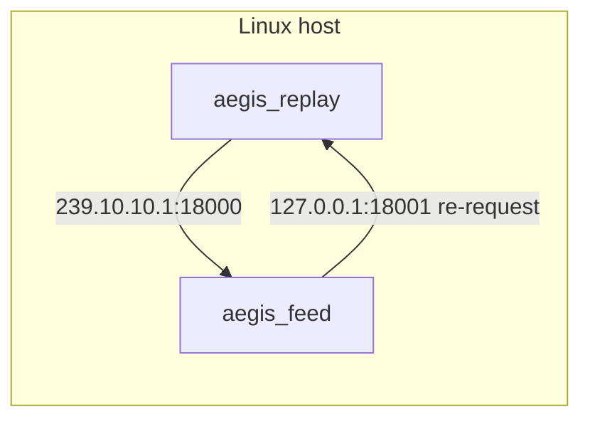
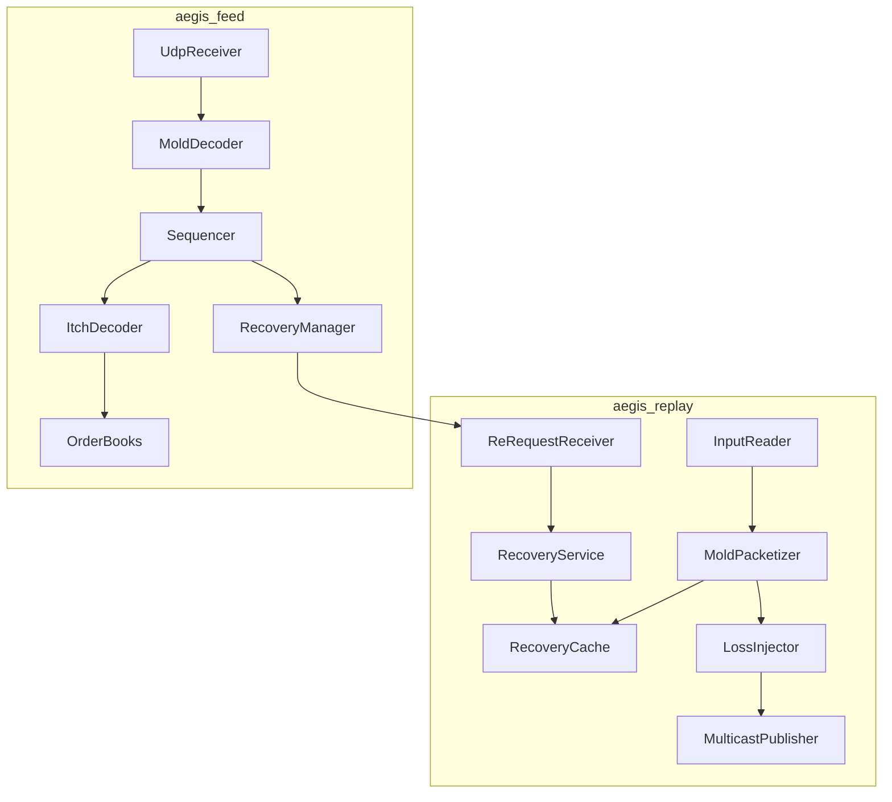
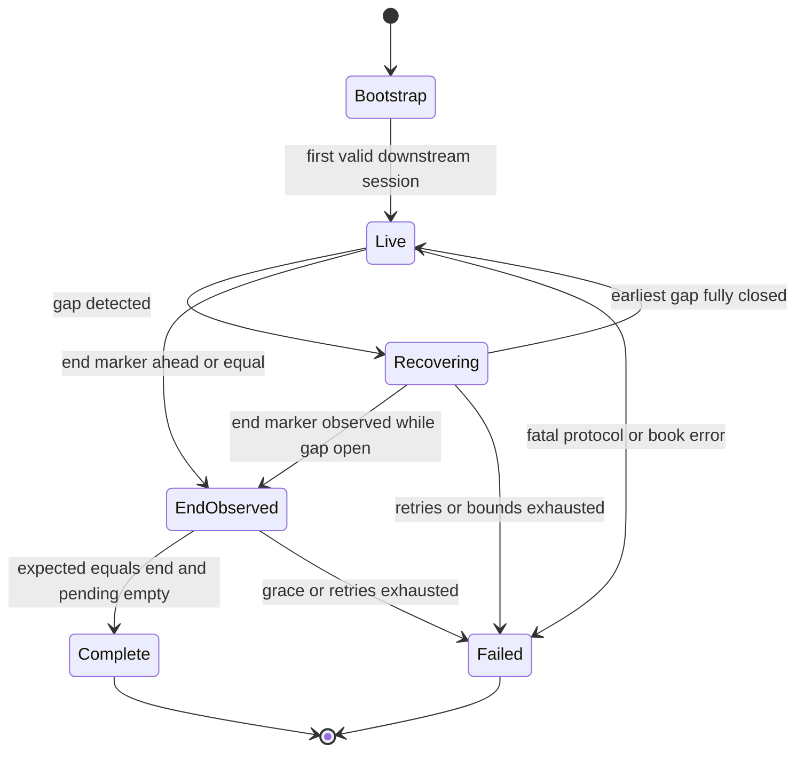
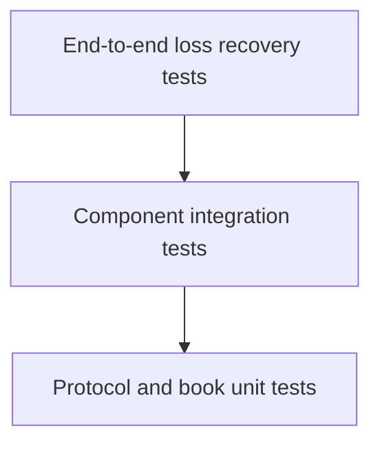

# AegisFeed Architecture and Engineering Specification

| Field | Value |
|---|---|
| Project | AegisFeed |
| Document role | Normative architecture, protocol, implementation, and delivery specification |
| Initial release target | MVP plus portfolio-ready V1 |
| Primary language | C++20 |
| Primary platform | Linux x86-64 |
| Build system | CMake |
| Application protocols | Nasdaq TotalView-ITCH 5.0 over MoldUDP64 |
| Intended audience | Human engineers and AI coding agents implementing the complete repository |

## 1. Document purpose

This document is the authoritative engineering contract for AegisFeed. It describes what the system is, what it is not, how every major component interacts, which protocol semantics are mandatory, how correctness is proved, which implementation order must be followed, and what must be delivered before the project may be called complete.

An engineer or AI coding agent should be able to implement AegisFeed from this document without inventing unstated product behavior. When implementation details conflict with this document, this document wins unless it is explicitly amended in the repository through an architecture decision record.

This document uses normative requirement language:

- **MUST** and **MUST NOT** identify mandatory behavior.
- **SHOULD** and **SHOULD NOT** identify the expected design unless a documented reason justifies a deviation.
- **MAY** identifies an optional behavior.
- **MVP** identifies the smallest portfolio-shippable version.
- **V1** identifies the hardened, benchmarked, resume-ready release.

### 1.1 Instructions for AI implementers

An AI agent implementing this project MUST follow these rules:

1. Read this entire document before creating or changing code.
2. Implement phases in the dependency order defined in Section 24.
3. Do not add trading strategies, dashboards, brokerage APIs, databases, DPDK, AF_XDP, or unrelated frameworks.
4. Do not optimize code that does not yet have correctness tests and a baseline benchmark.
5. Do not claim zero-copy, lock-free, wait-free, production-grade, exchange-grade, nanosecond latency, or lossless behavior unless the exact claim is demonstrated and documented.
6. Do not silently relax a MUST requirement. Record a proposed deviation in `docs/adr/` and obtain approval before implementing it.
7. Keep the normal feed-handler hot path deterministic and single-threaded through MVP.
8. Preserve protocol byte order, field widths, fixed-point prices, session semantics, and sequence semantics exactly.
9. Treat malformed input and unresolved sequence gaps as correctness failures, not warnings.
10. Update this document when an approved architecture decision changes externally visible behavior.

## 2. Executive summary

AegisFeed is a deterministic C++20 market-data infrastructure project. It reads historical Nasdaq TotalView-ITCH 5.0 messages, packages them into MoldUDP64 datagrams, publishes those datagrams over UDP multicast, deliberately introduces controlled packet loss, detects sequence gaps at the receiver, requests retransmission over UDP unicast, rebuilds a contiguous message stream, decodes ITCH messages, reconstructs order-level books for selected symbols, and proves recovery correctness by comparing the recovered final state with a clean direct replay.

The project consists of two primary executables:

- `aegis_replay`: historical input reader, MoldUDP64 packetizer, multicast publisher, deterministic loss injector, retransmission cache, and re-request server.
- `aegis_feed`: multicast receiver, MoldUDP64 parser, session and sequence manager, gap recovery manager, ITCH decoder, symbol filter, order-book builder, metrics reporter, and final state verifier.

A third executable, `aegis_bench`, SHOULD be delivered for V1 to isolate decoding, book-update, and end-to-end performance measurements.

The system is not an exchange, matching engine, trading bot, brokerage client, or strategy simulator. Its engineering value comes from protocol correctness, failure recovery, deterministic state, and measured systems performance.

## 3. Product goals

### 3.1 Primary goals

1. Demonstrate correct parsing of real binary exchange messages.
2. Demonstrate correct implementation of MoldUDP64 downstream framing and re-request behavior.
3. Demonstrate sequence-aware recovery from multicast packet loss.
4. Demonstrate deterministic order-book reconstruction for selected symbols.
5. Demonstrate explicit failure behavior when the stream cannot be recovered.
6. Produce reproducible throughput, latency, recovery, and memory measurements.
7. Produce a repository that can be understood and demonstrated from a fresh clone.
8. Provide credible interview material around networking, byte order, memory bounds, state machines, recovery, invariants, measurement, and tradeoffs.

### 3.2 Success statement

AegisFeed succeeds when the following statement is true:

> Given the same historical ITCH input and symbol selection, a clean direct replay and a MoldUDP64 network replay containing deterministic packet loss produce exactly the same canonical final book state, while the network replay reports zero unresolved gaps, zero invalid book transitions, and successful recovery of every requested message.

### 3.3 Educational and portfolio outcomes

The final project SHOULD make the following engineering knowledge visible:

- Big-endian binary decoding without undefined behavior.
- Fixed-width integer modeling and fixed-point price handling.
- UDP multicast membership and unicast request-response behavior.
- Distinction between application messages, datagrams, and sequence numbers.
- Normal-path versus recovery-path design.
- Bounded memory and explicit overflow policy.
- Deterministic state reconstruction.
- Correctness invariants and fail-closed behavior.
- Performance measurement that separates parser, book, network, and recovery costs.

## 4. Scope

### 4.1 In scope for MVP

The MVP MUST include:

- Linux C++20 implementation.
- CMake build.
- Historical length-prefixed Nasdaq ITCH input adapter.
- MoldUDP64 downstream packet construction.
- UDP multicast publication and subscription on a local host or local network.
- MoldUDP64 heartbeat and end-of-session recognition.
- Configurable MoldUDP64 session identifier.
- Sequence numbers beginning at one for each replay session.
- Deterministic multicast packet loss injection.
- Bounded retransmission cache.
- UDP unicast MoldUDP64 re-request handling.
- Receiver gap detection.
- Receiver buffering of messages received ahead of a gap.
- Duplicate and overlapping retransmission handling.
- Ordered delivery of ITCH messages to the decoder.
- ITCH message decoding for the required book-building subset.
- Book reconstruction for a configured symbol set.
- Direct replay verification path.
- Deterministic final state digest.
- Integration test proving digest equality after injected loss.
- Clear terminal summary.
- Unit tests and sanitizer-clean execution.

### 4.2 In scope for portfolio-ready V1

V1 MUST add:

- Reproducible offline microbenchmarks.
- Clean end-to-end and recovery benchmarks.
- p50, p99, and p99.9 processing distributions where meaningful.
- CPU, compiler, kernel, flags, workload, and run-count documentation.
- CI with GCC and Clang.
- AddressSanitizer and UndefinedBehaviorSanitizer test jobs.
- Config validation and stable exit codes.
- Structured failure summaries.
- Bounded recovery retries and timeouts.
- Multiple deterministic loss scenarios.
- Reordered and duplicate datagram tests.
- End-of-session recovery grace period.
- Architecture, protocol, recovery, and benchmark documentation.
- A one-command demonstration script.

### 4.3 Optional stretch scope

The following MAY be attempted only after V1 acceptance criteria pass:

- `recvmmsg` receive batching.
- CPU affinity.
- `SO_BUSY_POLL` comparison.
- A split pipeline using a cache-aligned SPSC queue.
- A preallocated active-order pool.
- A fixed-capacity open-addressing order-ID index.
- File-backed full-session retransmission indexing.
- Snapshot export and deterministic restart.
- Schema-generated ITCH codecs.
- Additional ITCH message types that do not change MVP book semantics.

### 4.4 Explicit non-goals

AegisFeed MUST NOT include the following in MVP or V1:

- Live Nasdaq connectivity.
- Licensed data redistribution.
- Brokerage or exchange credentials.
- OUCH order entry.
- FIX order entry.
- A matching engine.
- A trading strategy.
- Market making.
- PnL, positions, or risk calculations.
- Price prediction or machine learning.
- A React, web, or GUI dashboard.
- REST or GraphQL APIs.
- A database.
- Kubernetes or cloud deployment.
- DPDK, AF_XDP, RDMA, or FPGA acceleration.
- Cross-host latency claims without clock synchronization.
- Claims about real exchange-to-trader latency.

## 5. Normative references

The implementation MUST use the official specifications as the source of truth for protocol fields:

1. [Nasdaq TotalView-ITCH 5.0 Specification](https://www.nasdaqtrader.com/content/technicalsupport/specifications/dataproducts/NQTVITCHSpecification.pdf)
2. [Nasdaq MoldUDP64 Protocol Specification](https://www.nasdaqtrader.com/content/technicalsupport/specifications/dataproducts/moldudp64.pdf)

If these documents change after implementation begins, the repository MUST record the exact document revision or retrieval date used for the release. A protocol change MUST NOT be adopted accidentally through an unreviewed code change.

## 6. System context



### 6.1 Actors

| Actor | Responsibility |
|---|---|
| Developer | Builds, configures, runs, tests, and profiles the system |
| Replay server | Emulates an exchange multicast feed and retransmission server |
| Feed receiver | Emulates a trading firm's market-data feed handler |
| Direct verifier | Computes the expected final state without network transport |
| Test harness | Injects deterministic failures and verifies invariants |
| Benchmark harness | Measures isolated component and end-to-end performance |

### 6.2 Primary use cases

1. Replay a clean ITCH stream over multicast and reconstruct selected books.
2. Drop known multicast datagrams and recover their messages through re-requests.
3. Receive duplicate retransmissions without double-applying messages.
4. Receive newer multicast data while recovery is in progress and buffer it safely.
5. Fail explicitly when requested messages are no longer in the recovery cache.
6. Compare clean and recovered canonical final states.
7. Benchmark the decoder, book builder, clean transport, and recovery path independently.

## 7. Functional requirements

### 7.1 Input and replay requirements

| ID | Requirement |
|---|---|
| FR-IN-001 | The replayer MUST accept a path to a decompressed length-prefixed ITCH binary file. |
| FR-IN-002 | The file reader MUST validate every two-byte big-endian message length before reading the payload. |
| FR-IN-003 | A truncated length field or payload MUST terminate replay with an input-framing error. |
| FR-IN-004 | The replayer MUST support a configurable maximum message count for fast demos and tests. |
| FR-IN-005 | The replayer SHOULD support a start-message offset only after correct session-from-one behavior is implemented and documented. |
| FR-IN-006 | The replayer MUST assign MoldUDP64 sequence numbers independently of ITCH tracking numbers. |
| FR-IN-007 | The first application message in a replay session MUST have MoldUDP64 sequence number 1 unless an explicit recovery/restart mode is later designed. |
| FR-IN-008 | The replayer MUST stop with an error if an ITCH payload exceeds the configured application maximum. |

### 7.2 MoldUDP64 publication requirements

| ID | Requirement |
|---|---|
| FR-MOLD-001 | The publisher MUST emit a 20-byte MoldUDP64 downstream header. |
| FR-MOLD-002 | Session MUST occupy bytes 0 through 9. |
| FR-MOLD-003 | First-message sequence number MUST occupy bytes 10 through 17 as an unsigned big-endian integer. |
| FR-MOLD-004 | Message count MUST occupy bytes 18 through 19 as an unsigned big-endian integer. |
| FR-MOLD-005 | Every message block MUST contain a two-byte big-endian payload length followed by the exact ITCH payload bytes. |
| FR-MOLD-006 | A message MUST NOT be split across MoldUDP64 datagrams. |
| FR-MOLD-007 | Normal datagrams MUST remain at or below the configured UDP payload limit. |
| FR-MOLD-008 | The default UDP payload limit MUST be 1,400 bytes to avoid ordinary Ethernet IP fragmentation. |
| FR-MOLD-009 | The publisher MUST send heartbeats during configured idle periods. |
| FR-MOLD-010 | A heartbeat MUST contain the next sequence number and a message count of zero. |
| FR-MOLD-011 | End of session MUST use message count `0xFFFF` and the next sequence number. |
| FR-MOLD-012 | The publisher MUST retain recovery service for a configurable grace period after input exhaustion. |

### 7.3 Loss injection requirements

| ID | Requirement |
|---|---|
| FR-LOSS-001 | Loss injection MUST be deterministic for a fixed configuration and seed. |
| FR-LOSS-002 | MVP MUST support dropping every Nth normal multicast datagram. |
| FR-LOSS-003 | A dropped multicast datagram's messages MUST remain in the recovery cache. |
| FR-LOSS-004 | Heartbeats, end-of-session messages, and recovery responses MUST NOT be dropped by default. |
| FR-LOSS-005 | V1 SHOULD support an explicit packet-index drop list. |
| FR-LOSS-006 | V1 MAY support seeded probabilistic loss, duplication, and delay. |
| FR-LOSS-007 | Every injected action MUST increment a visible metric. |

### 7.4 Receiver and sequencing requirements

| ID | Requirement |
|---|---|
| FR-SEQ-001 | The receiver MUST track one active ten-byte MoldUDP64 session. |
| FR-SEQ-002 | The receiver MUST track the next application sequence number expected for ordered delivery. |
| FR-SEQ-003 | Messages MUST reach the ITCH decoder exactly once and in strictly increasing MoldUDP64 sequence order. |
| FR-SEQ-004 | A packet beginning above the next expected sequence MUST create or extend a gap. |
| FR-SEQ-005 | Messages above a gap MUST be buffered and MUST NOT reach the decoder early. |
| FR-SEQ-006 | Messages below the next expected sequence MUST be treated as duplicates unless the packet partially overlaps the expected sequence. |
| FR-SEQ-007 | For partial overlap, the receiver MUST skip the processed prefix and accept only the contiguous unseen suffix. |
| FR-SEQ-008 | Buffered duplicate sequences MUST NOT replace already-buffered payloads unless their bytes are identical. |
| FR-SEQ-009 | Two payloads with the same session and sequence but different bytes MUST be treated as stream corruption. |
| FR-SEQ-010 | The reorder store MUST be bounded by message count and byte count. |
| FR-SEQ-011 | Reorder-store exhaustion MUST fail the session rather than silently discard data. |
| FR-SEQ-012 | End of session MUST NOT produce success while gaps or pending buffered messages remain. |

### 7.5 Recovery requirements

| ID | Requirement |
|---|---|
| FR-REC-001 | The receiver MUST send a MoldUDP64 Request Packet when it detects a missing sequence range. |
| FR-REC-002 | The request MUST use the active session, first missing sequence, and requested message count. |
| FR-REC-003 | The receiver MUST send the request from the same UDP socket used to receive multicast so unicast responses return to that socket. |
| FR-REC-004 | The recovery server MUST return standard MoldUDP64 downstream datagrams via UDP unicast. |
| FR-REC-005 | A recovery response MUST contain only messages from the requested session and range. |
| FR-REC-006 | If all requested messages do not fit in one datagram, the server MUST send only complete messages that fit. |
| FR-REC-007 | The receiver MUST issue follow-up requests until the gap is closed or retry policy is exhausted. |
| FR-REC-008 | Recovery requests MUST be retried after a configurable timeout. |
| FR-REC-009 | Recovery retry exhaustion MUST fail the session. |
| FR-REC-010 | A recovery-cache miss MUST be visible and MUST eventually fail the receiver session. |
| FR-REC-011 | The receiver MUST tolerate a retransmitted packet arriving after the same messages were recovered another way. |
| FR-REC-012 | The receiver MUST drain newly contiguous buffered messages immediately after advancing the expected sequence. |

### 7.6 ITCH decoding requirements

| ID | Requirement |
|---|---|
| FR-ITCH-001 | The decoder MUST parse integers explicitly as big-endian values. |
| FR-ITCH-002 | The decoder MUST support unsigned 16-, 32-, 48-, and 64-bit reads. |
| FR-ITCH-003 | The decoder MUST check payload length before reading any field. |
| FR-ITCH-004 | The decoder MUST NOT reinterpret unaligned raw bytes as packed C++ structs. |
| FR-ITCH-005 | Prices MUST remain unsigned fixed-point integers with four implied decimal places. |
| FR-ITCH-006 | The decoder MUST support message types `S`, `R`, `A`, `F`, `E`, `C`, `X`, `D`, and `U`. |
| FR-ITCH-007 | Each supported message type MUST have an exact expected payload length. |
| FR-ITCH-008 | The decoder MUST recognize the official book-neutral message registry in Section 13.10 so real ITCH sessions can be replayed without treating documented administrative and trade messages as unknown. |
| FR-ITCH-009 | Unknown message types MUST fail by default. |
| FR-ITCH-010 | The decoder MUST produce a typed event or typed administrative result, not a loosely typed string map. |

### 7.7 Order-book requirements

| ID | Requirement |
|---|---|
| FR-BOOK-001 | The system MUST reconstruct active displayed orders for configured symbols. |
| FR-BOOK-002 | The system MUST maintain aggregate displayed shares and order count per price level. |
| FR-BOOK-003 | The system MUST maintain best bid and best ask when the relevant side is non-empty. |
| FR-BOOK-004 | An Add Order MUST fail if its order reference is already active. |
| FR-BOOK-005 | An execution or cancellation MUST fail if its share count exceeds remaining displayed shares. |
| FR-BOOK-006 | An order reaching zero shares MUST be removed from the active-order index and price level. |
| FR-BOOK-007 | An empty price level MUST be removed. |
| FR-BOOK-008 | A Delete MUST remove all remaining displayed shares. |
| FR-BOOK-009 | A Replace MUST remove the original order and add the new order with inherited side, symbol, and attribution. |
| FR-BOOK-010 | For an Executed With Price message, displayed shares MUST be removed from the original resting price level, not the execution-price level. |
| FR-BOOK-011 | Book mutation MUST occur only after ordered MoldUDP64 delivery and successful ITCH decoding. |
| FR-BOOK-012 | Book state MUST be deterministic for identical ordered input and configuration. |

### 7.8 Verification and output requirements

| ID | Requirement |
|---|---|
| FR-VER-001 | The project MUST provide a direct non-network replay path. |
| FR-VER-002 | Direct and network paths MUST use the same symbol selection and book semantics. |
| FR-VER-003 | The system MUST produce a canonical final state digest. |
| FR-VER-004 | Success MUST require equal clean and recovered digests in the integration demo. |
| FR-VER-005 | Success MUST require zero unresolved gaps and zero invalid book mutations. |
| FR-VER-006 | The summary MUST distinguish received datagrams, received messages, duplicate messages, buffered messages, requested messages, and recovered messages. |
| FR-VER-007 | The summary MUST report configuration and dataset bounds needed to reproduce the run. |

## 8. Non-functional requirements

### 8.1 Correctness

| ID | Requirement |
|---|---|
| NFR-COR-001 | Correctness takes priority over throughput and latency. |
| NFR-COR-002 | The system MUST fail closed on unresolved stream corruption. |
| NFR-COR-003 | Debug builds MUST enable internal invariant checking. |
| NFR-COR-004 | Release builds MUST preserve boundary validation and externally observable correctness checks. |
| NFR-COR-005 | Tests MUST be deterministic and MUST NOT depend on public network availability. |

### 8.2 Performance

| ID | Requirement |
|---|---|
| NFR-PERF-001 | Normal ordered delivery SHOULD avoid per-message heap allocation after initialization. |
| NFR-PERF-002 | Recovery-path allocation MAY occur within documented bounds. |
| NFR-PERF-003 | Logging MUST NOT run per message in normal benchmark mode. |
| NFR-PERF-004 | Performance claims MUST identify hardware, compiler, build type, flags, workload, and run count. |
| NFR-PERF-005 | Average latency alone MUST NOT be used as the primary latency claim. |
| NFR-PERF-006 | Throughput, parser latency, book latency, end-to-end processing latency, and recovery time MUST be reported separately. |

### 8.3 Resource bounds

| ID | Requirement |
|---|---|
| NFR-RES-001 | Retransmission cache capacity MUST be finite and configurable. |
| NFR-RES-002 | Reorder-store message count and bytes MUST be finite and configurable. |
| NFR-RES-003 | Maximum ITCH application payload MUST be finite and validated. |
| NFR-RES-004 | UDP payload size MUST be finite and validated against header and message requirements. |
| NFR-RES-005 | The receiver MUST expose overflow counters and terminate on correctness-threatening overflow. |

### 8.4 Portability and build

| ID | Requirement |
|---|---|
| NFR-BUILD-001 | MVP and V1 MUST target Linux. |
| NFR-BUILD-002 | Production code MUST compile as C++20 with GCC and Clang. |
| NFR-BUILD-003 | The build MUST support Debug, Release, and sanitizer configurations. |
| NFR-BUILD-004 | Production runtime code SHOULD depend only on the C++ standard library and POSIX/Linux networking APIs. |
| NFR-BUILD-005 | CI MUST not require historical Nasdaq data. |

### 8.5 Maintainability

| ID | Requirement |
|---|---|
| NFR-MAINT-001 | Protocol parsing, transport sequencing, and book mutation MUST be separate modules. |
| NFR-MAINT-002 | Public interfaces MUST express ownership and lifetime. |
| NFR-MAINT-003 | Raw socket descriptors MUST be owned by RAII wrappers. |
| NFR-MAINT-004 | The hot path MUST not throw exceptions. |
| NFR-MAINT-005 | Configuration defaults MUST exist in one canonical definition. |
| NFR-MAINT-006 | Requirement-affecting changes MUST update tests and documentation. |

## 9. Platform and engineering constraints

### 9.1 Supported platform

- Linux x86-64 is the normative platform.
- Ubuntu or a comparable modern Linux distribution is recommended for development and CI.
- GCC and Clang are required compiler families.
- macOS MAY be used for editing, but it is not an acceptance-test platform because Linux-specific receive batching, busy polling, and performance tooling differ.
- Windows is out of scope.

### 9.2 C++ constraints

- Language standard: C++20.
- No C++23-only library facilities such as `std::expected` may be assumed.
- Hot-path functions SHOULD be `noexcept` where truthful.
- Raw owning pointers are prohibited.
- `std::span<const std::byte>` SHOULD represent borrowed packet data.
- `std::chrono::steady_clock` MUST be used for local elapsed-time measurement.
- ITCH timestamps MUST NOT be treated as local arrival timestamps.

### 9.3 Dependency policy

Production binaries SHOULD remain dependency-light. Acceptable categories are:

- C++ standard library.
- POSIX/Linux socket APIs.
- CMake and CTest.
- A test-only framework if pinned and documented.
- A benchmark-only framework if pinned and documented.
- Optional zlib support for developer tooling, not required for core tests.

Historical data MUST NOT be committed to the repository. Small synthetic binary fixtures created specifically for tests MUST be committed.

## 10. High-level deployment model

The normative MVP demonstration runs both processes on one Linux host:



Default network values:

| Setting | Default |
|---|---|
| Multicast IPv4 group | `239.10.10.1` |
| Downstream port | `18000` |
| Recovery server address | `127.0.0.1` |
| Recovery server port | `18001` |
| Multicast TTL | `1` |
| Multicast loopback | enabled |
| Session | `AEGIS00001` |
| Maximum UDP payload | `1400` bytes |

The system MAY run across two hosts on the same network, but V1 MUST NOT make cross-host latency claims unless clock synchronization is explicitly designed and documented.

## 11. Process and threading model

### 11.1 Normative MVP model

Both primary processes use one deterministic event-loop thread.

#### `aegis_replay` event loop

1. Drain pending re-request datagrams from a non-blocking recovery socket.
2. Serve valid recovery requests from the retransmission cache.
3. Read enough ITCH messages to construct the next downstream datagram.
4. Insert each message into the retransmission cache before possible transmission.
5. Apply deterministic loss policy to the normal multicast datagram.
6. Send or intentionally drop the datagram.
7. Apply configured pacing.
8. Send heartbeat when idle for the configured interval.
9. On input exhaustion, send repeated end-of-session datagrams and continue serving recovery requests during the grace period.

This design avoids a mutex on every cached message and keeps loss injection reproducible.

#### `aegis_feed` event loop

1. Receive a multicast or unicast datagram on the feed socket.
2. Parse and validate MoldUDP64 framing.
3. Validate or establish the session.
4. Classify the datagram relative to `next_expected_sequence`.
5. Deliver an immediately contiguous message in place.
6. Buffer ahead-of-gap messages by sequence.
7. Send or retry recovery requests when needed.
8. Drain buffered messages whenever the contiguous prefix advances.
9. Decode each released ITCH message.
10. Update symbol directory, selected books, and metrics.
11. Observe heartbeat and end-of-session state.
12. Finalize only after the end marker is known and all preceding messages are processed.

### 11.2 Why the feed hot path is single-threaded

The single-thread design is intentional:

- A single owner mutates sequence state.
- A single owner mutates every selected book.
- No locks are required in the normal receive, decode, and apply path.
- Ordered delivery is easier to prove.
- Packet-buffer lifetime remains local.
- Benchmarks provide a trustworthy baseline.
- Recovery interleaving is deterministic.

Multithreading MUST NOT be added to the MVP solely to use a concurrency keyword on a resume.

### 11.3 Optional V1 experiment

After the fused path passes all correctness tests, an optional split mode MAY use:

```text
RX + sequence + decode thread
        |
        v
cache-aligned bounded SPSC queue
        |
        v
single book-owner thread
```

The split path MUST produce the same digest and pass the same recovery tests. Its benchmark MUST include the queue and scheduling cost. The project MUST report the measured result even if the split version is slower.

## 12. Wire protocol design

### 12.1 Byte-order rules

All numeric MoldUDP64 fields are unsigned big-endian values. All numeric ITCH fields are big-endian unless the official ITCH specification explicitly says otherwise.

The code MUST use explicit byte assembly or well-defined byte-swap helpers. It MUST NOT rely on the host being little-endian or use unaligned typed pointer reads.

Required primitive readers:

```cpp
bool read_u8(std::span<const std::byte> bytes, std::size_t offset, std::uint8_t& out) noexcept;
bool read_u16_be(std::span<const std::byte> bytes, std::size_t offset, std::uint16_t& out) noexcept;
bool read_u32_be(std::span<const std::byte> bytes, std::size_t offset, std::uint32_t& out) noexcept;
bool read_u48_be(std::span<const std::byte> bytes, std::size_t offset, std::uint64_t& out) noexcept;
bool read_u64_be(std::span<const std::byte> bytes, std::size_t offset, std::uint64_t& out) noexcept;
```

Required primitive writers mirror the readers.

### 12.2 Historical input framing

The historical input adapter assumes the common Nasdaq sample-file framing:

```text
+------------------------+--------------------------+
| Message length: 2 B BE | ITCH payload: length B  |
+------------------------+--------------------------+
```

The two-byte length is file framing. It is not an ITCH field and is not included in the ITCH payload length.

The input reader MUST:

1. Read exactly two bytes.
2. Decode an unsigned big-endian payload length.
3. Reject zero unless an explicit fixture format documents it.
4. Reject a length above `max_itch_message_bytes`.
5. Read exactly that number of payload bytes.
6. Return a borrowed or copied payload with a stable lifetime through packetization.
7. Detect clean end-of-file only between messages.

### 12.3 MoldUDP64 downstream datagram layout

```text
Offset  Size  Field
0       10    Session
10      8     First message sequence number, unsigned big-endian
18      2     Message count, unsigned big-endian
20      ...   Zero or more message blocks

Message block:
0       2     Message length, unsigned big-endian
2       N     Message data
```

The first message has the sequence number in the header. Each following message in the same datagram has the next implicit sequence number.

Example:

```text
Header sequence: 1000
Message count:   3

Block 0 sequence: 1000
Block 1 sequence: 1001
Block 2 sequence: 1002
Next expected:    1003
```

### 12.4 MoldUDP64 request packet layout

```text
Offset  Size  Field
0       10    Session
10      8     First requested message sequence, unsigned big-endian
18      2     Requested message count, unsigned big-endian
```

The request has no message blocks.

The receiver MUST send this request to the configured re-request server using the same socket bound for downstream reception. The server MUST send recovery downstream datagrams via unicast to the source address and source port of the request.

### 12.5 Session representation

`MoldSession` is exactly ten bytes. It is not a null-terminated C string.

Normative representation:

```cpp
using MoldSession = std::array<std::byte, 10>;
```

CLI session input MUST be:

- One through ten printable ASCII characters.
- Right-padded with ASCII spaces to ten bytes.
- Printed in logs with trailing spaces trimmed.

Session comparison MUST compare all ten bytes.

### 12.6 Datagram-size policy

The default `max_datagram_bytes` is 1,400 and includes the complete 20-byte MoldUDP64 header plus all message blocks.

Packetization algorithm:

1. Begin a new datagram with a 20-byte header reservation.
2. Read the next ITCH payload.
3. Compute `candidate_size = current_size + 2 + payload_size`.
4. If candidate size is within the limit, append the block.
5. Otherwise, emit the current non-empty datagram and start another.
6. If one message cannot fit in an otherwise empty configured datagram, terminate with a configuration error.

The implementation MUST NOT use IP fragmentation as part of normal operation.

### 12.7 Heartbeats

When no normal downstream data has been sent for `heartbeat_interval`, the publisher SHOULD send a downstream header containing:

- Active session.
- Sequence number of the next application message that would be sent.
- Message count zero.
- No message blocks.

The receiver MUST NOT advance its application sequence on a heartbeat. A heartbeat with a next sequence above the receiver's `next_expected_sequence` reveals a gap and MUST trigger recovery.

### 12.8 End of session

After input exhaustion, the replayer MUST:

1. Determine the next sequence number after the final application message.
2. Send a downstream header with count `0xFFFF`.
3. Repeat the end marker at the configured interval during the recovery grace period.
4. Continue accepting and serving valid re-requests during the grace period.
5. Exit successfully after the grace period unless the replayer itself encountered an error.

The receiver MUST finalize only when:

- It has observed an end marker for the active session.
- `next_expected_sequence` equals the end marker sequence.
- The pending reorder store is empty.
- No recovery request remains outstanding.
- No fatal decode or book error occurred.

### 12.9 Recovery response packing

The recovery server MUST use standard downstream datagrams, not a custom response type.

For a request `[start, count]`:

1. Validate session.
2. Validate that count is greater than zero.
3. Find `start` in the bounded cache.
4. Append consecutive cached messages while they remain available and fit in one datagram.
5. Set response header sequence to the first returned sequence.
6. Set response count to the number actually returned.
7. Send response via UDP unicast to the request source.

If the requested range is larger than one datagram, the receiver discovers that the gap is still open and sends the next request. The server MUST NOT split one ITCH message.

### 12.10 MoldUDP64 parser validation

Before sequencing a datagram, the parser MUST validate:

- Datagram length is at least 20 bytes.
- Session field is present.
- Header values can be decoded.
- For a normal message count, exactly that number of complete message blocks exists.
- Every block length is nonzero and within the ITCH application maximum.
- No block extends beyond the datagram.
- No unexpected trailing bytes remain after the declared blocks.
- Heartbeat and end-of-session datagrams contain no message blocks.
- `first_sequence + message_count` does not overflow `uint64_t`.

Malformed datagrams MUST NOT partially mutate sequence or book state.

## 13. ITCH 5.0 application protocol scope

### 13.1 Common header fields

Every required ITCH message begins with:

| Offset | Length | Field |
|---:|---:|---|
| 0 | 1 | Message type |
| 1 | 2 | Stock locate |
| 3 | 2 | Tracking number |
| 5 | 6 | Timestamp in nanoseconds since midnight |

The stock-locate code is not stable across trading days. It MUST be populated from the current session's Stock Directory messages.

The ITCH tracking number is Nasdaq internal metadata. It MUST NOT be used as the MoldUDP64 sequence number.

### 13.2 Required message registry

| Type | Name | Exact bytes | MVP action |
|---|---|---:|---|
| `S` | System Event | 12 | Track session event code and metrics |
| `R` | Stock Directory | 39 | Map stock locate to normalized symbol |
| `A` | Add Order, no MPID | 36 | Add selected-symbol order |
| `F` | Add Order with MPID | 40 | Add selected-symbol order and attribution |
| `E` | Order Executed | 31 | Reduce resting order shares |
| `C` | Order Executed With Price | 36 | Reduce resting shares and record execution metadata |
| `X` | Order Cancel | 23 | Partially reduce resting shares |
| `D` | Order Delete | 19 | Remove resting order |
| `U` | Order Replace | 35 | Replace order ID, quantity, and price |

The decoder MUST check exact payload length before reading fields.

### 13.3 Required typed message models

The implementation SHOULD define typed value models equivalent to the following. Field names may vary, but types and semantics MUST not.

```cpp
struct ItchHeader {
    char type;
    std::uint16_t stock_locate;
    std::uint16_t tracking_number;
    std::uint64_t timestamp_ns;
};

enum class Side : std::uint8_t { Buy, Sell };

struct AddOrder {
    ItchHeader header;
    std::uint64_t order_reference;
    Side side;
    std::uint32_t shares;
    std::array<char, 8> stock;
    std::uint32_t price_1e4;
    std::optional<std::array<char, 4>> attribution;
};

struct OrderExecuted {
    ItchHeader header;
    std::uint64_t order_reference;
    std::uint32_t executed_shares;
    std::uint64_t match_number;
};

struct OrderExecutedWithPrice {
    ItchHeader header;
    std::uint64_t order_reference;
    std::uint32_t executed_shares;
    std::uint64_t match_number;
    bool printable;
    std::uint32_t execution_price_1e4;
};

struct OrderCancel {
    ItchHeader header;
    std::uint64_t order_reference;
    std::uint32_t cancelled_shares;
};

struct OrderDelete {
    ItchHeader header;
    std::uint64_t order_reference;
};

struct OrderReplace {
    ItchHeader header;
    std::uint64_t original_order_reference;
    std::uint64_t new_order_reference;
    std::uint32_t shares;
    std::uint32_t price_1e4;
};
```

### 13.4 Add Order semantics

For `A` and `F`:

1. Decode and normalize the eight-byte right-space-padded stock symbol.
2. Validate side is `B` or `S`.
3. Validate shares are greater than zero.
4. Validate price according to supported ITCH numeric range.
5. If symbol is selected, ensure order reference is not active.
6. Insert active order.
7. Increase aggregate shares and order count at the resting price level.
8. Update best price for the side.

`F` attribution is metadata. It does not change book arithmetic.

### 13.5 Execution semantics

For `E`:

1. Find active order by reference.
2. Validate `executed_shares > 0`.
3. Validate `executed_shares <= remaining_shares`.
4. Subtract shares from the order's resting price level.
5. Subtract shares from the active order.
6. Remove order and possibly price level at zero.
7. Record match number only in optional execution metrics or audit output.

For `C`, apply the same book reduction. The `execution_price_1e4` describes the execution, but displayed shares MUST be removed from the order's original resting display price. This distinction is mandatory.

### 13.6 Cancel semantics

For `X`:

1. Find the active order.
2. Validate positive cancelled shares.
3. Validate cancelled shares do not exceed remaining shares.
4. Reduce order and price-level shares.
5. Remove the order and empty level if remaining shares reach zero.

### 13.7 Delete semantics

For `D`:

1. Find the active order.
2. Remove all remaining shares from its price level.
3. Decrement level order count.
4. Remove the order.
5. Remove an empty level.

### 13.8 Replace semantics

For `U`:

1. Find the original active order.
2. Validate new order reference is not active.
3. Preserve original side, symbol, and attribution.
4. Remove the original order and its remaining displayed shares.
5. Create a new order using the new reference, new displayed shares, and new price.
6. Treat the replacement as a new order for any future queue-priority extension.

The original order reference MUST become invalid after the replacement is applied.

### 13.9 Known book-neutral messages

The implementation MUST recognize documented ITCH 5.0 messages that do not affect the current displayed book. It MAY avoid fully decoding fields that the project never consumes, but it MUST validate the type's exact message length, parse the common header when present, count the message, preserve its MoldUDP64 sequence, and classify it as known book-neutral.

Book-neutral messages MUST NOT be described as unknown or malformed merely because AegisFeed does not expose their business fields.

The decoder may skip a documented book-neutral message only if:

- Their type and exact length are registered.
- Their count is reported.
- The skip is documented.
- They remain fully covered by transport sequencing.

The decoder MUST distinguish `known_book_neutral` from `unknown`.

### 13.10 Required known book-neutral registry

The following current ITCH 5.0 messages are structurally recognized in MVP even though they do not mutate the displayed order book maintained by AegisFeed:

| Type | Name | Exact bytes | AegisFeed behavior |
|---|---|---:|---|
| `H` | Stock Trading Action | 25 | Validate, count, optionally record trading state |
| `Y` | Reg SHO Restriction | 20 | Validate and count |
| `L` | Market Participant Position | 26 | Validate and count |
| `V` | MWCB Decline Level | 35 | Validate and count |
| `W` | MWCB Status | 12 | Validate and count |
| `K` | IPO Quoting Period Update | 28 | Validate and count |
| `J` | LULD Auction Collar | 35 | Validate and count |
| `h` | Operational Halt | 21 | Validate and count |
| `P` | Trade, non-cross | 44 | Validate and count; no displayed-book mutation |
| `Q` | Cross Trade | 40 | Validate and count; no displayed-book mutation |
| `B` | Broken Trade | 19 | Validate and count; no current-book mutation |
| `I` | Net Order Imbalance Indicator | 50 | Validate and count |
| `N` | Retail Price Improvement Indicator | 20 | Validate and count |
| `O` | Direct Listing With Capital Raise Price Discovery | 48 | Validate and count |

This table reflects the current official ITCH 5.0 specification referenced in Section 5. Exact lengths MUST be covered by tests. If the official protocol introduces a new type, strict mode MUST fail until the registry and tests are deliberately updated.

## 14. Component architecture



### 14.1 `ByteReader` and `ByteWriter`

Responsibilities:

- Bounds-checked fixed-width reads and writes.
- Explicit big-endian conversion.
- ASCII array extraction.
- No ownership of underlying buffers.
- No exceptions in normal operation.

Non-responsibilities:

- Protocol-specific validation.
- Socket I/O.
- Allocation.

Tests MUST cover every primitive at minimum, maximum, offset, truncated, and endian-sensitive values.

### 14.2 `LengthPrefixedItchReader`

Responsibilities:

- Own input file handle through RAII.
- Read two-byte length prefixes.
- Produce complete ITCH payloads.
- Track file byte offset and application message index.
- Distinguish clean EOF from truncation and I/O failure.

Suggested result model:

```cpp
enum class ReadStatus { Message, EndOfFile, Error };

struct InputMessage {
    std::uint64_t index;
    std::uint64_t file_offset;
    std::uint16_t size;
    std::array<std::byte, kMaxItchMessageBytes> bytes;
};
```

### 14.3 `MoldPacketizer`

Responsibilities:

- Assign consecutive application sequence numbers.
- Build bounded downstream datagrams.
- Add message length prefixes.
- Return datagram metadata for cache insertion and loss injection.
- Build heartbeat and end-of-session datagrams.

The packetizer MUST NOT send sockets or decide loss.

### 14.4 `RecoveryCache`

MVP design: fixed-capacity circular message cache indexed by sequence modulo capacity.

Each slot stores:

```cpp
struct CachedMessage {
    std::uint64_t sequence;
    std::uint16_t size;
    std::array<std::byte, kMaxItchMessageBytes> bytes;
    bool valid;
};
```

Lookup succeeds only when:

- Slot is valid.
- Slot's full stored sequence equals the requested sequence.

Modulo equality alone is insufficient because the slot may have been overwritten by a later sequence.

Cache insertion occurs before normal multicast send or intentional drop. Recovery responses therefore remain possible for injected losses.

### 14.5 `LossInjector`

Inputs:

- Downstream datagram index.
- First sequence.
- Message count.
- Datagram type.
- Configured deterministic policy.

Output:

- `SendNormally`.
- `DropInjected`.
- Optional V1 actions `Duplicate` or `Delay`.

The loss injector MUST NOT mutate payload bytes.

### 14.6 `UdpMulticastPublisher`

Responsibilities:

- Own UDP socket.
- Configure multicast interface, TTL, and loopback.
- Configure send buffer.
- Send complete datagrams.
- Report syscall failures and partial-send anomalies.

UDP `sendto` should either send the entire datagram or fail. Any unexpected size result is an I/O error.

### 14.7 `RecoveryService`

Responsibilities:

- Receive and parse 20-byte request packets.
- Validate request session and count.
- Look up consecutive messages.
- Pack as many complete messages as fit.
- Unicast standard downstream datagrams to the request source.
- Count valid, malformed, wrong-session, hit, partial-hit, and miss requests.

The recovery service is control-path code. Clarity and validation matter more than micro-optimization.

### 14.8 `UdpFeedSocket`

Responsibilities:

- Create UDP socket.
- Enable `SO_REUSEADDR` before bind.
- Bind downstream port.
- Join configured IPv4 multicast group with `IP_ADD_MEMBERSHIP`.
- Configure receive buffer.
- Send re-requests from the same socket.
- Receive multicast and recovery unicast datagrams.
- Expose sender address to classify metrics, not correctness.

The receiver MUST rely on session and sequence for correctness, not on source address alone.

### 14.9 `MoldDecoder`

Responsibilities:

- Validate downstream framing completely before state mutation.
- Return session, first sequence, message count, datagram type, and message spans.
- Validate request framing when used by the server.

The returned message spans are valid only while the input datagram buffer remains alive. The sequencer MUST process contiguous spans synchronously or copy them into bounded pending storage.

### 14.10 `Sequencer`

The sequencer is the central correctness component.

State:

- Receiver lifecycle state.
- Active session.
- `next_expected_sequence`.
- Optional observed end sequence.
- Bounded pending-message map keyed by sequence.
- Recovery request state.
- Metrics.

Responsibilities:

- Classify every normal downstream datagram.
- Release contiguous messages exactly once.
- Copy ahead-of-gap messages into pending storage.
- Detect conflicting duplicates.
- Trigger requests.
- Drain the contiguous pending prefix.
- Decide when end-of-session is complete.

The sequencer MUST NOT interpret ITCH fields.

### 14.11 `PendingMessageStore`

For MVP, ahead-of-gap datagrams SHOULD be decomposed into individual messages and stored by their implicit sequence number:

```cpp
struct PendingMessage {
    std::uint64_t sequence;
    std::uint16_t size;
    std::array<std::byte, kMaxItchMessageBytes> bytes;
};
```

An ordered map is acceptable because this is abnormal-path work. This choice simplifies:

- Overlapping datagrams.
- Partial retransmissions.
- Duplicate detection.
- Draining exact sequence prefixes.
- Bound accounting by message.

Normal contiguous traffic MUST NOT be copied into this store.

### 14.12 `RecoveryManager`

State:

- First missing sequence.
- Current request start.
- Requested count.
- Attempt count.
- Last request time.
- Timeout.
- Maximum retries.

Responsibilities:

- Detect when a request is required.
- Coalesce a visible gap into a bounded request range.
- Send request.
- Retry on timeout.
- Advance request start after partial recovery.
- Clear state after the contiguous stream closes the gap.
- Fail after exhaustion.

Only one earliest-gap request needs to be active in MVP. Newer gaps remain represented in pending storage and become the earliest gap later.

### 14.13 `ItchDecoder`

Responsibilities:

- Validate exact type length.
- Parse common header.
- Parse message-specific fields.
- Normalize ASCII and enum fields.
- Produce typed messages.
- Classify known book-neutral messages.
- Return structured errors containing sequence, type, offset, and reason.

The decoder MUST NOT mutate books.

### 14.14 `SymbolDirectory`

Responsibilities:

- Map current-session stock-locate codes to normalized symbols.
- Map requested symbols to located codes when discovered.
- Reject conflicting directory entries for the same locate code.
- Expose whether every configured symbol has been discovered.

Normalization:

- Strip right ASCII spaces.
- Preserve case from the feed.
- Reject embedded nulls in strict mode.
- Compare CLI symbols after normalization to uppercase ASCII.

### 14.15 `BookStore`

Responsibilities:

- Own one `OrderBook` per selected symbol.
- Route typed order events by stock locate.
- Maintain active-order lookup.
- Maintain bid and ask price-level aggregates.
- Apply message-specific invariants.
- Produce snapshots, metrics, and canonical digest input.

MVP suggested containers:

```cpp
std::unordered_map<std::uint64_t, OrderRecord> active_orders;
std::map<std::uint32_t, PriceLevel, std::greater<>> bids;
std::map<std::uint32_t, PriceLevel, std::less<>> asks;
```

The active-order map SHOULD reserve configured capacity before replay. Container replacement is an optimization phase, not an MVP prerequisite.

### 14.16 `StateDigest`

The digest provides a compact deterministic comparison for large runs. It is not a cryptographic attestation.

Canonicalization MUST sort and encode:

1. Symbols lexicographically.
2. Bid levels descending by price.
3. Ask levels ascending by price.
4. Active orders within each symbol by order reference number.
5. Fixed-width integer values in a documented canonical byte order.

The reported state identity SHOULD include:

- 64-bit stable non-cryptographic hash.
- Active order count.
- Bid level count.
- Ask level count.
- Aggregate displayed shares.
- Last processed MoldUDP64 sequence.

Small-fixture integration tests MUST compare exact canonical states, not only hashes.

### 14.17 `MetricsRegistry`

Minimum counters:

```text
input_messages_read
downstream_datagrams_built
downstream_datagrams_sent
downstream_datagrams_injected_drop
downstream_datagrams_received
heartbeats_sent
heartbeats_received
end_markers_sent
end_markers_received
mold_messages_received
mold_messages_delivered
duplicate_messages
overlap_prefix_messages
pending_messages_inserted
pending_messages_drained
pending_messages_peak
gaps_detected
recovery_requests_sent
recovery_requests_retried
recovery_requests_received
recovery_cache_hits
recovery_cache_misses
recovery_messages_sent
recovery_messages_received
itch_messages_decoded
itch_messages_book_neutral
itch_decode_errors
book_adds
book_executes
book_cancels
book_deletes
book_replaces
book_errors
selected_active_orders
selected_bid_levels
selected_ask_levels
```

Metrics MUST distinguish datagrams from application messages.

## 15. Sequencing and recovery algorithm

### 15.1 Receiver lifecycle states



### 15.2 Bootstrap behavior

On the first valid downstream datagram:

- If no expected session was configured, adopt its exact ten-byte session.
- If an expected session was configured, require exact equality.
- Set `next_expected_sequence` to configured start, default 1.
- Process the datagram through normal classification.

A first datagram with sequence greater than one MUST trigger recovery from one. It MUST NOT silently reset expected sequence to the first observed value.

### 15.3 Datagram classification

For a normal downstream datagram:

```text
packet_start = header.sequence
packet_count = header.message_count
packet_end_exclusive = packet_start + packet_count
expected = next_expected_sequence
```

Cases:

1. `packet_end_exclusive <= expected`
   - Entire datagram is duplicate or stale.
   - Validate framing, count duplicates, apply nothing.

2. `packet_start < expected < packet_end_exclusive`
   - Skip `expected - packet_start` message blocks.
   - Process remaining messages as if packet started at expected.

3. `packet_start == expected`
   - Deliver each message in order.
   - Increment expected after each successful delivery.
   - Drain pending store.

4. `packet_start > expected`
   - A gap exists `[expected, packet_start)`.
   - Copy each datagram message into pending storage by sequence.
   - Start or maintain recovery for the earliest gap.

### 15.4 Delivery transaction boundary

For each contiguous message at sequence `s`:

1. Decode ITCH payload without mutating state.
2. If decode fails, session enters `Failed`; expected does not advance.
3. If message is book-neutral, update count and accept.
4. If message targets an unselected symbol, validate required structural fields and accept without book mutation.
5. If selected, apply the typed event transactionally to the book.
6. If book validation fails, session enters `Failed`; expected does not advance.
7. After successful handling, set `next_expected_sequence = s + 1`.

The implementation SHOULD arrange book operations so validation happens before mutation or rollback is unnecessary.

### 15.5 Pending insertion

When buffering sequence `s`:

- If `s < expected`, count duplicate and ignore.
- If no entry exists, validate capacity then copy payload.
- If an entry exists with identical length and bytes, count duplicate and ignore.
- If an entry exists with different bytes, fail with conflicting-sequence corruption.

### 15.6 Pending drain

After any successful contiguous delivery:

```text
while pending contains next_expected_sequence:
    remove pending message for next_expected_sequence
    deliver transactionally
```

If draining exposes a later gap, the recovery manager MUST request the new earliest missing sequence.

### 15.7 Gap size and request count

Let the smallest pending sequence be `pending_min`.

```text
gap_start = next_expected_sequence
gap_size = pending_min - gap_start
request_count = min(gap_size, configured_max_request_messages, 65534)
```

`65534` avoids using the downstream end-of-session sentinel as a requested count in this implementation, even though the request field is conceptually a count.

If no pending message exists but a heartbeat or end marker shows a higher next sequence, calculate gap size from that observed sequence.

### 15.8 Recovery retries

Default policy:

| Setting | Default |
|---|---:|
| Request timeout | 10 ms |
| Maximum attempts per current request start | 5 |
| Maximum request count | 4,096 messages |
| Maximum pending messages | 65,536 |
| Maximum pending bytes | 8 MiB |

The receiver event loop MUST wake often enough to evaluate a retry timeout even when no datagrams arrive. `poll`, `ppoll`, or a receive timeout is acceptable. A permanently blocking `recvfrom` without timeout handling is not.

### 15.9 Recovery cache miss

The official request format does not define a custom negative acknowledgment. MVP behavior:

- Server counts a miss and sends no invalid data.
- Receiver retries according to policy.
- Receiver eventually fails with `RecoveryExhausted`.
- Demo can force this scenario by using a cache smaller than the induced gap delay.

A custom negative acknowledgment MUST NOT be placed inside MoldUDP64 without clearly declaring it as a non-standard extension. No such extension is required for MVP or V1.

### 15.10 End-marker ordering

If an end marker announces sequence `end_sequence`:

- If `end_sequence < expected`, treat as stale duplicate end marker.
- If `end_sequence == expected` and pending is empty, complete.
- If `end_sequence > expected`, record end sequence and recover the missing range.
- If another end marker for the same session reports a different end sequence, fail with session corruption.

## 16. Order-book data model

### 16.1 Core types

```cpp
using OrderId = std::uint64_t;
using Price4 = std::uint32_t;
using Shares = std::uint32_t;
using StockLocate = std::uint16_t;

struct OrderRecord {
    OrderId id;
    StockLocate stock_locate;
    Side side;
    Price4 price;
    Shares remaining;
    std::array<char, 4> attribution;
    bool has_attribution;
};

struct PriceLevel {
    std::uint64_t aggregate_shares;
    std::uint32_t order_count;
};
```

Aggregate shares MUST use at least 64 bits even though individual order shares use 32 bits.

### 16.2 Book ownership

One feed event-loop thread owns all selected books in MVP. References to book internals MUST NOT escape to other threads.

### 16.3 Price-level invariants

For each active price level:

- `order_count > 0`.
- `aggregate_shares > 0`.
- Aggregate shares equal the sum of remaining shares for orders at that symbol, side, and price.
- Order count equals the number of active orders at that symbol, side, and price.

For each active order:

- Remaining shares are positive.
- Its price level exists.
- Its side matches the side collection containing the level.
- Its stock locate maps to the containing symbol.

### 16.4 Best-price semantics

- Best bid is the highest active bid price.
- Best ask is the lowest active ask price.
- An empty side has no best price and MUST be represented with an optional, not a zero price.
- The project SHOULD NOT assert that best bid is always below best ask because administrative state and partial datasets can make that invariant unsafe for this scope.

### 16.5 Symbol-selection behavior

The receiver parses and sequences every message. Book storage is selective.

For an ITCH message with a stock locate:

- If locate is selected, fully decode and apply supported book semantics.
- If locate is known but unselected, validate the registered message length and skip book mutation.
- If a modification message references a selected locate, the order MUST exist in that selected book.
- If a requested symbol never appears in Stock Directory before session completion, report it as missing and fail verification unless `--allow-missing-symbols` is explicitly enabled for a test.

## 17. Configuration design

### 17.1 `aegis_replay` CLI

Required or defaulted options:

```text
--input PATH
--group IPV4                       default 239.10.10.1
--port PORT                        default 18000
--recovery-bind IPV4               default 127.0.0.1
--recovery-port PORT               default 18001
--interface IPV4                   default 0.0.0.0 or explicit auto selection
--session TEXT                     default AEGIS00001
--max-datagram-bytes N             default 1400
--cache-messages N                 default 1048576
--heartbeat-ms N                   default 1000
--end-grace-ms N                   default 2000
--end-repeat-ms N                  default 100
--rate-msgs N|max                  default max for benchmarks, paced for demo
--limit-messages N                 default unlimited
--drop-every N                     default 0, disabled
--drop-packets LIST                V1 optional
--loss-seed N                      default fixed documented seed
--quiet
--verbose
```

### 17.2 `aegis_feed` CLI

```text
--group IPV4                       default 239.10.10.1
--port PORT                        default 18000
--interface IPV4                   default 0.0.0.0 or explicit auto selection
--recovery IPV4:PORT               default 127.0.0.1:18001
--session TEXT                     optional expected session
--start-sequence N                 default 1
--symbols CSV                      required for portfolio demo
--receive-buffer-bytes N           documented default
--max-datagram-bytes N             default 1400
--max-pending-messages N           default 65536
--max-pending-bytes N              default 8388608
--request-timeout-ms N             default 10
--request-max-attempts N           default 5
--request-max-messages N           default 4096
--unknown-policy fail|count-skip   default fail
--expected-digest HEX              optional
--report-every-ms N                default 1000, 0 disables periodic report
--quiet
--verbose
```

### 17.3 Configuration validation

Validation occurs before sockets or large buffers are created. Reject:

- Invalid multicast address.
- Port zero where not meaningful.
- Same invalid bind configuration.
- Session longer than ten bytes.
- Datagram size below header plus one smallest message block.
- Datagram size above safe configured UDP limit.
- Zero cache capacity.
- Zero pending capacity.
- Recovery request count zero.
- Symbols list empty in normal portfolio mode.
- Contradictory quiet and verbose modes.
- Negative or overflowing numeric CLI inputs.

## 18. Error model and exit codes

### 18.1 Error categories

```cpp
enum class ErrorCategory {
    Configuration,
    InputIo,
    InputFraming,
    SocketIo,
    MoldFraming,
    Session,
    Sequence,
    Recovery,
    ItchDecode,
    BookInvariant,
    ResourceLimit,
    Verification,
    Internal
};
```

Every fatal error SHOULD include:

- Category.
- Stable code.
- Human-readable message.
- Active session when known.
- Mold sequence when known.
- Datagram index when known.
- ITCH type when known.
- File offset when known.
- Relevant limit and observed value.

### 18.2 Exit codes

| Code | Meaning |
|---:|---|
| 0 | Successful completion |
| 2 | Configuration or CLI error |
| 3 | Input I/O or framing error |
| 4 | Socket or network error |
| 5 | MoldUDP64 or ITCH protocol error |
| 6 | Sequence or recovery failure |
| 7 | Book invariant failure |
| 8 | Verification or digest mismatch |
| 9 | Resource-limit failure |
| 10 | Internal invariant failure |

### 18.3 Logging policy

- Fatal errors go to stderr.
- Final machine-readable summary MAY go to stdout as JSON when requested.
- Normal benchmark mode MUST suppress per-message logging.
- Verbose recovery logs MUST be rate-limited.
- Logs MUST label datagrams and messages correctly.
- Sensitive credentials do not exist in this project and MUST NOT be introduced.

## 19. Observability and reporting

### 19.1 Periodic status

Optional periodic output MAY include:

```text
session=AEGIS00001 expected=1250001 rx_msg=1249988 pending=12 gaps=3 recovered=27 rate=1.82Mmsg/s
```

### 19.2 Final summary

The receiver's final summary MUST include:

```text
AegisFeed version
Build type
Session
Input or run label
Selected symbols
First sequence
Final expected sequence
Datagrams received
Messages received
Messages delivered
Duplicate messages
Peak pending messages
Gaps detected
Recovery requests and retries
Messages recovered
Unresolved gaps
ITCH decode errors
Book errors
Active orders and levels
Elapsed time
Processing rate
State digest and structural totals
Final status: PASS or FAIL
```

The output MUST NOT print a successful integrity result merely because the process exited normally.

## 20. Performance measurement design

### 20.1 Measurement principles

1. Correctness tests and performance benchmarks are separate modes.
2. One benchmark should isolate one primary cost.
3. Warm-up occurs before timed measurement.
4. Multiple runs are required.
5. Median throughput and tail distributions are reported.
6. Tool overhead is documented.
7. No exchange-latency claim is made from historical ITCH timestamps.
8. VM and shared-host noise is acknowledged.

### 20.2 Decoder microbenchmark

Input:

- In-memory collection of valid ITCH messages representing required types.
- Large repeated workload to amortize timer overhead.

Measures:

- Messages per second.
- Bytes per second.
- Cycles per message when stable cycle measurement is available.
- Branches, branch misses, instructions, and cache misses through `perf stat`.

Excludes:

- File I/O.
- UDP.
- Sequencing.
- Book mutation.

### 20.3 Book microbenchmark

Input:

- Pre-decoded typed event sequence containing adds, partial executions, cancels, deletes, and replaces.

Measures:

- Updates per second.
- Time per update by event type.
- Allocation count if instrumentation is available.
- Peak active orders and levels.

Excludes binary parsing and network I/O.

### 20.4 Clean pipeline benchmark

Path:

```text
MoldUDP64 receive -> framing -> sequence -> ITCH decode -> selected book apply
```

Measures:

- End-to-end delivered messages per second.
- Datagram receive rate.
- CPU utilization.
- Peak memory.
- Sampled processing latency from receive return to completion of datagram application.

The measured latency MUST be labeled local processing latency, not market-data latency.

### 20.5 Recovery benchmark

Workloads:

- Drop every 1,000th datagram.
- Drop two consecutive datagrams at selected indices.
- Reorder two selected datagrams in V1 test mode.
- Duplicate selected datagrams.
- Cache-miss failure scenario.

Measures:

- Detection time.
- Re-request count.
- Retry count.
- Messages recovered.
- Maximum pending depth.
- Time from gap detection until contiguous live state resumes.
- Final digest equality.

### 20.6 Percentiles

Per-message clock reads can distort the hot path. V1 SHOULD use one of:

- Sample one message or datagram every fixed power-of-two interval.
- Collect timing in a dedicated microbenchmark rather than production loop.
- Use a documented low-overhead cycle counter with calibration and core pinning as an optional experiment.

Collected samples may be sorted after the run to calculate p50, p99, and p99.9. The sampling policy MUST be reported.

### 20.7 Required benchmark metadata

Every committed benchmark result MUST state:

- Date.
- Git commit.
- CPU model.
- Core count and whether affinity was used.
- RAM.
- Linux distribution and kernel.
- Compiler and version.
- CMake build type and flags.
- Dataset or synthetic workload identity.
- Number of messages.
- Selected symbols.
- Network topology, such as loopback or two hosts.
- Loss policy.
- Warm-up length.
- Timed runs and aggregation method.

## 21. Security and robustness considerations

AegisFeed is a local portfolio system, but it processes untrusted binary input and UDP datagrams. It MUST be robust against malformed data.

### 21.1 Input safety

- Validate length before every read.
- Check integer additions for overflow.
- Bound all copies.
- Never use `strcpy`, unbounded formatting, or null-termination assumptions.
- Do not cast packet bytes to packed structs.
- Do not trust message count without walking all blocks.
- Do not allocate memory directly proportional to an unvalidated network field.

### 21.2 Network safety

- Ignore or count wrong-session packets according to strict configuration.
- Rate-limit recovery requests to prevent a tight request loop.
- Bound pending data.
- Bound retries.
- Validate recovery response bytes exactly like multicast bytes.
- Treat conflicting same-sequence payloads as corruption.

### 21.3 Denial-of-service boundaries

This project does not promise resilience to hostile line-rate traffic. It MUST still terminate safely or reject input when configured bounds are exceeded.

### 21.4 Fuzzing

V1 SHOULD include fuzz targets for:

- MoldUDP64 downstream parser.
- MoldUDP64 request parser.
- ITCH message decoder.
- Length-prefixed file reader using in-memory data.

Fuzzing MUST run with sanitizers. A short deterministic fuzz corpus MAY run in CI; long fuzzing runs are developer workflows.

## 22. Testing strategy

### 22.1 Test pyramid



### 22.2 Byte primitive tests

Required cases:

- Zero values.
- Maximum values.
- Known endian-sensitive patterns such as `0x0102030405060708`.
- Exact-boundary reads.
- One-byte-short reads.
- Offset overflow attempts.
- 48-bit timestamp reads.
- ASCII right-padding behavior.

### 22.3 MoldUDP64 unit tests

Required cases:

- One-message downstream datagram.
- Multi-message downstream datagram and implicit sequences.
- Exact 20-byte heartbeat.
- Exact 20-byte end marker.
- Exact 20-byte request.
- Empty/truncated header.
- Truncated message length.
- Payload shorter than declared.
- Extra trailing bytes.
- Count larger than present blocks.
- Message too large.
- Sequence overflow.
- Wrong session.

Golden expected bytes MUST be used for at least one downstream packet and request packet.

### 22.4 ITCH decoder unit tests

For each required type:

- Construct a complete golden byte array.
- Decode every field.
- Assert exact values.
- Test one-byte-short payload.
- Test one-byte-long payload.
- Test invalid side or printable flag where applicable.
- Test maximum fixed-width values where meaningful.

### 22.5 Book unit tests

Required scenarios:

- Add buy and sell.
- Multiple orders at one price.
- Multiple price levels.
- Best bid and ask updates.
- Partial execute.
- Full execute.
- Execute with different execution price.
- Partial cancel.
- Full cancel by shares reaching zero.
- Delete.
- Replace at same price.
- Replace at different price.
- Replace with new quantity.
- Duplicate add failure.
- Unknown order execution failure.
- Over-execution failure.
- Over-cancel failure.
- Delete unknown order failure.
- Replace unknown original failure.
- Replace to active new ID failure.
- Aggregate invariant recomputation.

### 22.6 Sequencer unit tests

Required scenarios:

- In-order single-message packets.
- In-order multi-message packets.
- Entire duplicate packet.
- Partial-overlap packet.
- One missing packet followed by future packet.
- Multiple future packets buffered.
- Recovery closes gap and drains buffer.
- Partial recovery response requires another request.
- Duplicate recovery response.
- Conflicting same-sequence bytes.
- Pending count overflow.
- Pending byte overflow.
- Retry timeout and exhaustion.
- Heartbeat reveals missing messages.
- End marker with no gap.
- End marker with gap.
- Conflicting end markers.

### 22.7 Integration tests

All integration tests use committed synthetic fixtures and loopback sockets or an in-process socket harness.

Required tests:

1. Clean multicast replay equals direct state.
2. Drop every Nth packet and recover equals direct state.
3. Consecutive dropped packets recover.
4. Duplicate datagrams do not change state.
5. Reordered datagrams recover and drain in order.
6. Cache miss produces deterministic failure.
7. End marker waits for recovery.
8. Wrong session is rejected.
9. Malformed recovery response is rejected.
10. Missing requested symbol is reported.

### 22.8 Independent reference oracle

Because direct and network paths share the C++ ITCH decoder, their matching digest alone does not validate decoder semantics. V1 SHOULD contain `tools/reference_book.py` implementing a deliberately simple independent parser for the required fixture subset.

For a small fixture:

- Python produces canonical exact state JSON.
- C++ direct replay produces canonical exact state JSON.
- CI compares the files exactly.

The Python oracle is test tooling, not the production path.

### 22.9 Sanitizers and analysis

Required CI or documented commands:

- AddressSanitizer.
- UndefinedBehaviorSanitizer.
- Compiler warnings treated as errors for project code.
- Optional ThreadSanitizer only if the stretch split pipeline is added.
- Optional clang-tidy profile.

## 23. Repository architecture

```text
AegisFeed/
├── CMakeLists.txt
├── CMakePresets.json
├── README.md
├── architecture.md
├── LICENSE
├── cmake/
│   └── CompilerWarnings.cmake
├── include/aegis/
│   ├── common/
│   │   ├── byte_reader.hpp
│   │   ├── byte_writer.hpp
│   │   ├── error.hpp
│   │   ├── result.hpp
│   │   ├── socket.hpp
│   │   └── types.hpp
│   ├── input/
│   │   └── itch_file_reader.hpp
│   ├── mold/
│   │   ├── mold_types.hpp
│   │   ├── mold_codec.hpp
│   │   ├── packetizer.hpp
│   │   ├── recovery_cache.hpp
│   │   └── loss_injector.hpp
│   ├── feed/
│   │   ├── sequencer.hpp
│   │   ├── pending_store.hpp
│   │   └── recovery_manager.hpp
│   ├── itch/
│   │   ├── itch_types.hpp
│   │   ├── itch_lengths.hpp
│   │   └── itch_decoder.hpp
│   ├── book/
│   │   ├── order_book.hpp
│   │   ├── book_store.hpp
│   │   └── state_digest.hpp
│   └── metrics/
│       ├── counters.hpp
│       └── report.hpp
├── src/
│   ├── common/
│   ├── input/
│   ├── mold/
│   ├── feed/
│   ├── itch/
│   ├── book/
│   ├── metrics/
│   └── app/
│       ├── replay_main.cpp
│       ├── feed_main.cpp
│       └── bench_main.cpp
├── tests/
│   ├── unit/
│   ├── integration/
│   ├── fixtures/
│   └── expected/
├── bench/
│   ├── decoder_bench.cpp
│   ├── book_bench.cpp
│   ├── pipeline_bench.cpp
│   └── results.md
├── tools/
│   └── reference_book.py
├── scripts/
│   ├── fetch_sample.sh
│   ├── generate_fixture.py
│   ├── demo.sh
│   ├── benchmark.sh
│   └── run_sanitizers.sh
├── docs/
│   ├── protocol.md
│   ├── recovery.md
│   ├── benchmarks.md
│   ├── limitations.md
│   └── adr/
└── .github/workflows/
    ├── build-test.yml
    └── sanitizers.yml
```

The implementation MAY consolidate directories early in Phase 0, but public module boundaries MUST remain recognizable.

## 24. Implementation phases and gates

Each phase has an exit gate. An AI agent MUST NOT treat a phase as complete merely because code was generated.

### Phase 0: Repository and build foundation

Deliverables:

- CMake project.
- `aegis_replay` and `aegis_feed` placeholder targets.
- Core library target.
- Debug and Release presets.
- Warning flags.
- CTest integration.
- Formatting configuration.
- Initial CI build on GCC and Clang.
- README pointing to this document.

Exit gate:

- Fresh configure and build succeeds.
- Empty smoke tests run through CTest.
- No architecture-dependent protocol code exists yet.

### Phase 1: Binary primitives and error model

Deliverables:

- Byte reader and writer.
- Fixed-width endian helpers.
- Ten-byte session type.
- Error categories and result type.
- RAII file and socket wrappers as needed.
- Unit tests.

Exit gate:

- All endian and truncation tests pass.
- Sanitizers pass.
- No raw packet cast exists.

### Phase 2: ITCH decoder and synthetic fixtures

Deliverables:

- Required message constants and lengths.
- Typed ITCH models.
- Decoder for `S`, `R`, `A`, `F`, `E`, `C`, `X`, `D`, and `U`.
- Known-neutral versus unknown classification.
- Golden binary fixture for each required type.
- Strict error reporting.

Exit gate:

- Every required field has an exact-value test.
- Short and long lengths fail.
- Invalid enums fail.
- Price remains fixed point.

### Phase 3: Book model

Deliverables:

- Symbol directory.
- Symbol selection.
- Order record and price levels.
- Add, execute, execute-with-price, cancel, delete, and replace semantics.
- Debug invariant recomputation.
- Canonical exact state serialization for small tests.
- Stable digest.

Exit gate:

- Complete book unit-test matrix passes.
- Random valid synthetic event sequences preserve invariants.
- Invalid mutations fail without partial state changes.

### Phase 4: Direct replay and oracle

Deliverables:

- Historical length-prefixed file reader.
- Direct replay executable or mode.
- Message limit.
- Selected-symbol final summary.
- Synthetic fixture generator.
- Independent Python reference for small fixture.

Exit gate:

- C++ and Python exact canonical states match for fixture.
- Truncated input fails correctly.
- Repeated direct runs produce identical digest and totals.

### Phase 5: Clean MoldUDP64 transport

Deliverables:

- Downstream codec.
- Request codec.
- Packetizer.
- Multicast publisher.
- Feed socket and group join.
- Receiver Mold parser.
- In-order sequencer.
- Heartbeat.
- End marker and grace period.

Exit gate:

- Golden Mold bytes pass.
- Clean multicast replay final state equals direct replay.
- Multi-message datagrams sequence correctly.
- Heartbeat does not advance application sequence.
- Clean end-of-session completes.

### Phase 6: Loss injection and recovery

Deliverables:

- Deterministic `drop-every` injector.
- Recovery cache.
- Re-request server.
- Pending message store.
- Gap detection.
- Request manager.
- Retry timer.
- Partial-response continuation.
- Duplicate and overlap handling.

Exit gate:

- Injected loss is visibly detected.
- Every lost message is recovered.
- Buffered messages are delivered only after gap closure.
- Final exact state and digest equal direct path.
- Cache-miss scenario fails explicitly.

This is the MVP completion gate.

### Phase 7: Hardening and failure matrix

Deliverables:

- Pending count and byte bounds.
- Wrong-session handling.
- Conflicting-duplicate detection.
- Reordered and duplicate injection tests.
- End marker ahead of gap.
- Malformed datagram integration tests.
- Stable exit codes.
- JSON summary option if desired.
- ASan and UBSan CI.

Exit gate:

- Full unit and integration suite passes under sanitizers.
- Every fatal class produces a stable nonzero exit.
- No run reports PASS with an unresolved gap.

### Phase 8: Benchmarking and portfolio polish

Deliverables:

- Decoder microbenchmark.
- Book microbenchmark.
- Clean pipeline benchmark.
- Recovery benchmark.
- Benchmark metadata and results.
- One-command demo.
- Final README architecture and demo sections.
- Limitations document.
- Release tag `v1.0.0` after acceptance.

Exit gate:

- Results are reproducible from documented commands.
- No unsubstantiated performance claim appears in README or resume bullets.
- Fresh-clone demo ends in an integrity PASS.

This is the portfolio-ready V1 gate.

## 25. MVP, V1, and stretch matrix

| Capability | MVP | V1 | Stretch |
|---|:---:|:---:|:---:|
| Required ITCH messages | Yes | Yes | More types optional |
| Historical direct replay | Yes | Yes | Full-session indexing optional |
| MoldUDP64 multicast | Yes | Yes | Multi-channel optional |
| Deterministic drop | Yes | Yes | Seeded delay/reorder optional |
| Re-request recovery | Yes | Yes | Multiple servers optional |
| Duplicate handling | Basic | Hardened | Cross-channel arbitration optional |
| Bounded pending store | Yes | Yes | Custom allocator optional |
| Clean versus recovered digest | Yes | Yes | Snapshot/restart optional |
| GCC and Clang CI | Basic | Required | More compilers optional |
| ASan and UBSan | Required | Required | Fuzz farm optional |
| Benchmarks | Basic throughput | Full suite | Busy-poll and split-mode comparisons |
| Single-thread feed path | Required | Required baseline | SPSC split experiment optional |
| GUI or web dashboard | No | No | No |
| Trading strategy | No | No | No |
| DPDK or FPGA | No | No | Out of project scope |

## 26. Acceptance criteria and definition of done

### 26.1 MVP definition of done

All items MUST be true:

- [ ] Repository builds on Linux using C++20.
- [ ] GCC and Clang compile the project.
- [ ] Byte readers and writers pass endian and bounds tests.
- [ ] Required ITCH decoders pass golden tests.
- [ ] Direct replay reconstructs expected fixture books.
- [ ] Python and C++ exact fixture state match.
- [ ] Clean multicast replay equals direct replay.
- [ ] Deterministic loss causes a visible sequence gap.
- [ ] Receiver sends a standards-shaped MoldUDP64 request.
- [ ] Server responds with standards-shaped downstream unicast data.
- [ ] Receiver buffers future messages during recovery.
- [ ] Recovered messages close the gap in order.
- [ ] Duplicate retransmissions do not apply twice.
- [ ] End marker waits for gap closure.
- [ ] Final recovered state equals direct state.
- [ ] Unresolved cache miss ends in explicit failure.
- [ ] ASan and UBSan runs pass.
- [ ] One demo command reproduces the recovery PASS.

### 26.2 V1 definition of done

In addition to MVP:

- [ ] Reorder and duplicate failure scenarios pass.
- [ ] Resource limits are configurable and tested.
- [ ] Exit codes are stable.
- [ ] CI runs tests on every push and pull request.
- [ ] Benchmarks are separated by component.
- [ ] Results include full environment metadata.
- [ ] p50, p99, and p99.9 are reported only for a documented sample method.
- [ ] README contains product summary, architecture, quick start, demo, results, and limitations.
- [ ] No historical market-data file is committed.
- [ ] A tagged release can be built from a fresh clone.
- [ ] Resume bullets use only measured, reproducible numbers.

## 27. Required demo experience

The finished repository SHOULD make the core engineering visible in under two minutes.

### 27.1 One-command mode

```bash
./scripts/demo.sh
```

The script SHOULD:

1. Build or verify the build.
2. Generate or locate a small legal synthetic fixture.
3. Run direct replay and capture expected digest.
4. Start `aegis_feed`.
5. Start `aegis_replay` with deterministic packet loss.
6. Wait for both processes.
7. Print the receiver summary.
8. Exit zero only when integrity passes.

### 27.2 Illustrative output shape

Values below are examples of fields, not promised performance:

```text
AegisFeed v1.0.0
session:                 AEGIS00001
symbols:                 AAPL,MSFT,NVDA
first_sequence:          1
next_expected_sequence:  100001

datagrams_received:      4127
messages_delivered:      100000
gaps_detected:           4
recovery_requests:       4
recovery_retries:        0
messages_recovered:      97
duplicates_discarded:    0
peak_pending_messages:   83
unresolved_gaps:         0

active_orders:           1842
bid_levels:              228
ask_levels:              241
state_digest:            6f2b3c...
expected_digest:         6f2b3c...
integrity:               PASS
```

Verbose demo mode SHOULD show a concise recovery story:

```text
[inject] dropped multicast datagram packet=1000 seq=24139 count=23
[gap] expected=24139 observed=24162 missing=23
[request] session=AEGIS00001 start=24139 count=23 attempt=1
[recovery] received start=24139 count=23
[drain] pending=41 next_expected=24203
[live] gap closed
```

## 28. Known limitations and honest claims

### 28.1 Data and market limitations

- The project uses historical or synthetic data.
- It does not connect to Nasdaq production systems.
- It does not distribute Nasdaq data.
- It maintains displayed order state for selected symbols, not every market product by default.
- It does not model hidden liquidity, matching, positions, or trading decisions.

### 28.2 Network limitations

- Loopback multicast does not reproduce exchange colocation networks.
- It does not model redundant A/B feeds.
- It does not model switch queueing, NIC hardware timestamps, PTP, or physical packet loss.
- The recovery cache is bounded and cannot recover arbitrarily old messages.
- The MVP uses one multicast channel and one re-request server.

### 28.3 Performance limitations

- Absolute results apply only to documented hardware and configuration.
- Historical exchange timestamps cannot measure local wire latency.
- VM results may contain scheduler and hypervisor noise.
- `std::unordered_map` and `std::map` are correctness-first MVP choices.
- A single-thread baseline is intentional.
- No kernel-bypass claim is permitted.

### 28.4 Verification limitations

- Matching direct and recovered digests proves transport/recovery equivalence under a shared C++ decoder.
- It does not independently prove the shared decoder is semantically correct.
- Golden field tests and the independent Python fixture oracle mitigate common-mode decoder errors.
- A non-cryptographic state digest can theoretically collide, so small fixtures compare exact canonical state too.

## 29. Design tradeoffs

### 29.1 Message-level pending store versus packet-level reorder buffer

Decision: store individual ahead-of-gap messages keyed by sequence.

Benefits:

- Simple overlap handling.
- Simple duplicate detection.
- Direct contiguous drain.
- Partial recovery responses fit naturally.

Cost:

- Copies and ordered-map allocation occur during abnormal recovery.

Rationale: recovery correctness and implementation clarity matter more than optimizing abnormal-path allocation.

### 29.2 Single-thread fused receiver versus staged pipeline

Decision: use fused single-thread receiver for MVP and as the V1 baseline.

Benefits:

- Deterministic ownership.
- No hot-path locks.
- Fewer lifetime hazards.
- Easier measurement and debugging.

Cost:

- Decode and book work can delay socket receives.

Mitigation: configure receive buffer, pace demos, add batching or SPSC only as measured stretch work.

### 29.3 Bounded memory versus always-recoverable semantics

Decision: all recovery storage is bounded.

Benefits:

- Predictable memory.
- Explicit operational limits.
- Realistic failure mode.

Cost:

- Old messages can become unrecoverable.

Behavior: fail closed and report the exact missing sequence range.

### 29.4 Standard containers versus custom structures

Decision: use standard containers in MVP.

Benefits:

- Faster delivery.
- Mature correctness.
- Easier review.

Cost:

- More allocation and pointer chasing.

Behavior: profile first; replace only a measured bottleneck in an optional optimization phase.

## 30. Architecture decision process

Changes to any of these require an ADR:

- Process count or thread ownership.
- Protocol framing.
- Sequence semantics.
- Recovery request or response behavior.
- Book event semantics.
- Failure policy.
- Default memory bounds.
- Data format for canonical state.
- New external production dependency.
- Scope expansion into order entry or strategies.

ADR template:

```text
# ADR-NNN: Title

Status: Proposed | Accepted | Rejected | Superseded
Date:

## Context
## Decision
## Alternatives considered
## Correctness consequences
## Performance consequences
## Testing changes
## Documentation changes
```

## 31. Requirement traceability

| Requirement area | Primary phase | Primary test layer |
|---|---|---|
| Input framing | Phase 4 | Unit and direct replay integration |
| Endian primitives | Phase 1 | Unit |
| ITCH decoding | Phase 2 | Golden unit and Python oracle |
| Book semantics | Phase 3 | Unit and invariant tests |
| Mold framing | Phase 5 | Golden unit and clean integration |
| Multicast transport | Phase 5 | Integration |
| Gap detection | Phase 6 | Sequencer unit and integration |
| Re-request recovery | Phase 6 | Integration |
| Duplicate and reorder behavior | Phase 7 | Unit and integration |
| Bounds and failure policy | Phase 7 | Failure matrix |
| Metrics and performance | Phase 8 | Benchmark harness |
| Fresh-clone demonstration | Phase 8 | Demo script and release check |

## 32. Example end-to-end event trace

Assume the replayer creates these datagrams:

```text
Packet 10: sequence 100, count 3 -> messages 100, 101, 102
Packet 11: sequence 103, count 2 -> messages 103, 104
Packet 12: sequence 105, count 3 -> messages 105, 106, 107
```

The loss injector drops Packet 11 from multicast.

Receiver behavior:

1. Packet 10 arrives while expected is 100.
2. Receiver delivers 100, 101, and 102. Expected becomes 103.
3. Packet 12 arrives with start 105.
4. Receiver recognizes missing range `[103, 105)`.
5. Receiver copies messages 105, 106, and 107 into pending storage.
6. Receiver sends request session `AEGIS00001`, start 103, count 2.
7. Replay server finds 103 and 104 in cache.
8. Server sends a unicast downstream packet with start 103 and count 2.
9. Receiver delivers 103 and 104. Expected becomes 105.
10. Receiver drains pending 105, 106, and 107. Expected becomes 108.
11. Receiver returns to Live state.

At no point may message 105 reach the ITCH decoder before 103 and 104.

## 33. Example book trace

Selected symbol: `AAPL`, stock locate 42.

```text
seq 500: A order=9001 side=B shares=100 price=1874325
seq 501: A order=9002 side=B shares=50  price=1874325
seq 502: E order=9001 executed=40
seq 503: U old=9002 new=9010 shares=70 price=1874300
seq 504: D order=9001
```

State transitions:

1. After 500:
   - Order 9001 remaining 100 at 187.4325.
   - Bid level 187.4325 has 100 shares and 1 order.
2. After 501:
   - Bid level 187.4325 has 150 shares and 2 orders.
3. After 502:
   - Order 9001 remaining 60.
   - Bid level 187.4325 has 110 shares and 2 orders.
4. After 503:
   - Order 9002 no longer exists.
   - Bid level 187.4325 has 60 shares and 1 order.
   - New order 9010 has 70 shares at 187.4300.
5. After 504:
   - Order 9001 removed.
   - Price level 187.4325 removed.
   - Best bid becomes 187.4300 with 70 shares.

## 34. Final implementation rules

Before merging any phase, verify:

1. The implementation matches the relevant MUST requirements.
2. Tests cover success, truncation, invalid value, and resource-limit behavior.
3. Failure occurs before partial mutation where required.
4. Logs distinguish datagrams, Mold messages, and ITCH messages.
5. New configuration has documented bounds and defaults.
6. Performance code does not weaken correctness checks.
7. No unsupported resume claim is introduced.
8. Documentation is updated with behavior changes.

The project is finished when a fresh clone can run one deterministic command that visibly drops multicast market-data packets, recovers the missing sequence range using MoldUDP64 re-requests, reconstructs the same selected-symbol book state as a clean direct replay, reports zero unresolved gaps, and exits with an integrity PASS.
